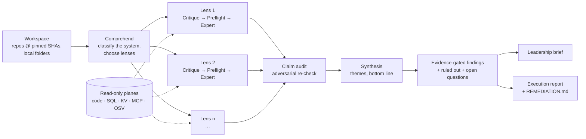

#  AI Theresa Waggle

[](https://github.com/ai-theresa-lab/ai-theresa-waggle/actions/workflows/test.yml)
[](https://github.com/ai-theresa-lab/ai-theresa-waggle/releases)
[](LICENSE)
[](package.json)

**Waggle audits a codebase (and, optionally, the data behind it) the way a careful reviewer would: it states falsifiable hypotheses, measures them against the code and data, lets an adversarial auditor attack every claim, and reports only what survives — with the evidence attached.**

> [!NOTE]
> Waggle was previously released as **accel-scope**. The name comes from the honeybee's *waggle dance*: a scout explores, comes back, and tells the hive exactly where to look. Waggle is self-hosted, single-user, runs on your own model keys, and never writes to the code or data it inspects.


**Contents:** [Overview](#overview) · [Method](#method) · [Quick start](#quick-start) · [Usage](#usage) · [Expert lenses](#expert-lenses) · [Connectors](#connectors) · [Privacy and telemetry](#privacy-and-telemetry) · [Limitations](#limitations-and-threats-to-validity) · [Contributors](#contributors) · [Citation](#citation)

## Overview

### Context

- Language models can now read an entire repository. Asked to "review this code", they produce fluent, plausible findings — but it is hard to tell which claims were actually checked, which were inferred, and which are wrong.
- A single pass tends to mirror the question: models agree with the premise they are given, and there is no record of what was ruled out.
- Many of the questions that matter cross the boundary between code and data ("why do these two dashboards disagree?", "does this permission check hold for every tenant?"). Answering them needs measurements, not opinions.

### Approach

Waggle treats an audit as **hypothesis testing** rather than summarization:

- **Falsifiable problems, not opinions.** Each expert lens poses problems that state what evidence would confirm or refute them, seeded by deterministic evidence (git history, repository structure, committed secrets).
- **Measurement on read-only planes.** Agents measure each problem against the cloned workspace and any connected data plane (warehouse SQL, key-value stores, MCP servers, vulnerability advisories) and return a verdict with the evidence used.
- **Adversarial claim audit.** A separate audit stage re-checks every claim against the workspace before it can reach a report.
- **Evidence gate.** A claim whose evidence does not resolve to the code or data becomes an *open question* (a coverage gap), not a finding. Checks that ran and came back negative are reported as *ruled out*.
- **Two audiences, one record.** A short Leadership brief (what matters, what to decide) and an Execution report (every finding with its evidence, fix, expected effect, "done when" and "how to verify", plus a `REMEDIATION.md` a coding agent can run).

### What it is not

Not a linter, a SAST rule engine or a test runner, and not a replacement for them: Waggle reads their kind of evidence and asks the questions they cannot express. It does not modify your repositories or data, and it does not run your code.

## Method



| Stage | What happens |
|---|---|
| **Comprehend** | Classifies the system, maps its product capabilities and chooses which expert lenses apply. |
| **Critique** | Per lens, poses evidence-seeded, falsifiable problems. |
| **Preflight** | Lints the plan: what to measure, and on which plane. |
| **Expert** | Measures each problem against the code and data planes and returns verdicts and mitigations. Lenses run in parallel. |
| **Claim audit** | Adversarially re-checks every claim against the workspace; unsupported wording is downgraded or removed. |
| **Synthesis** | Groups verdicts into themes and a bottom line. |
| **Findings** | A deterministic, evidence-gated finding contract (no model in this step). |
| **Reports** | The Leadership brief is model-written under a rubric-checked contract; the Execution report is rendered deterministically. |

Engineering properties that make runs inspectable and repeatable:

- **Read-only by construction** — agents get a default-deny tool allowlist (read, search, and mounted read-only data tools), and file access is confined to the workspace.
- **Bounded cost** — a per-run ledger attributes every model call; past 80% of the cap no new work starts.
- **Fail open, visibly** — a failed agent or connector is recorded as a *degraded stage* on the run instead of silently shrinking coverage.
- **Checkpoints** — every stage boundary is checkpointed, so a stopped or failed run resumes without repeating finished work.
- **Incremental re-scans** — unchanged code replays prior findings at no cost; findings are carried forward as new / fixed / persisting, and a finding is only called *fixed* when its code actually changed.
- **Memory as prior, not evidence** — durable notes (metric definitions, known traps) are recalled as context to re-verify, never cited as proof.

See [docs/ARCHITECTURE.md](docs/ARCHITECTURE.md) for the module-level design.

## Quick start

Requirements: Node.js 22.7+ and git.

```bash
git clone https://github.com/ai-theresa-lab/ai-theresa-waggle.git && cd ai-theresa-waggle
npm ci
ANTHROPIC_API_KEY=sk-ant-... npm start
```

Open <http://localhost:4317>. (You can also leave the key out and paste it in **Settings → API keys**, or rely on an existing local `claude` login.)

With Docker:

```bash
docker build -t waggle .
docker run --rm -p 127.0.0.1:4317:4317 -v waggle-data:/data -e ANTHROPIC_API_KEY=sk-ant-... waggle
```

## Usage

| Mode | What it does | Typical cost |
|---|---|---|
| **Quick Ask** | One question about your code or data ("Where do we compute monthly revenue, and do the two dashboards agree?"). One agent investigates and answers with cited evidence. | $0.30–1 |
| **Full Scan** | The whole method above, over the repos and data planes you select. | $5–30 |
| **Incremental re-scan** | Scanning the same targets again reuses everything the changes did not touch and reports what is new, fixed or still open. | a fraction of a Full Scan |
| **Memory** | Durable, editable, revertable notes about your projects that later runs recall as prior context. | — |

## API keys and cost

All model usage bills **your own** API keys. Keys are only ever sent to the provider's API.

| Key | | Used for |
|---|---|---|
| `ANTHROPIC_API_KEY` | required | Every agent in the pipeline (Claude Agent SDK). A Claude plan token from `claude setup-token` (`sk-ant-oat…`) also works, and without any key an existing local `claude` login is used (on macOS it is found in the Keychain). |
| `OPENAI_API_KEY` | optional | Report writing, quality-check judges and cross-report reconciliation try OpenAI first (and the `codex` CLI when installed) and fall back to Claude without it. |

Set them in the environment, in a `.env` file in the working directory, or in **Settings → API keys** (memory only, unless you tick *Save keys on this machine*, which writes `<data dir>/keys.json` with mode 0600).

Every run has a spend cap, **$20 by default** — change it in **Settings → Spending** or with `THERESA_RUN_BUDGET`. The run page shows live spend against the cap. The cap stops a run from *starting* new work; a step already in flight finishes, so the final cost can pass the cap by a small amount (the run page says so).

## Your first scan

1. **Connect → Public GitHub URL**: paste `https://github.com/<owner>/<repo>` (no token needed for public repos).
2. **Full Scan → New full scan**: tick the repo, optionally write what you care about in the brief ("is our auth safe?", "why do these two numbers disagree?"), and press **Run diagnosis**.
3. Watch the pipeline live. When it completes, open the **Leadership** report first; the **Execution** report has the details and the `REMEDIATION.md` export.

Private code: connect a GitHub personal access token with read-only access, or a **local folder** on this machine (or upload one from the browser).

## Expert lenses

Comprehend chooses among the built-in lenses (their IDs also appear in telemetry). Lenses are *value-free*: they describe methods and checks, never one organization's answers.

| ID | Lens |
|---|---|
| `appsec` | Application security / supply chain |
| `swe-arch` | Software architecture & code health |
| `release-eng` | Build / CI / release engineering |
| `api-stability` | Public API stability / SDK developer experience |
| `product-logic` | Business rules & application logic |
| `saas-tenancy` | Multi-tenant access & isolation |
| `baseline`, `analytics`, `data-eng` | Data & metric trust, analytics, pipelines / warehouse |
| `trust-safety` | Trust & safety |
| `mobile-ios`, `mobile-android` | Mobile apps |
| `recsys-mle` | Recommendation / ranking systems |

## Connectors

All connectors are read-only.

| Source | How |
|---|---|
| Public GitHub repos | Paste URLs. Cloned without credentials. |
| Private GitHub repos | A read-only personal access token. |
| Local folders | A path on this machine, or a folder uploaded from the browser. Local secrets (`.env` files other than templates such as `.env.example`, private keys, Waggle's own data folder) are left out of the scan. |
| BigQuery | A service-account key (JSON) with a read-only role. Queries are `SELECT`-only with a per-query scan cap. |
| SQL warehouse / Redis / any MCP server | The URL of a read-only MCP server (and an optional bearer token). The agent may call every tool the server exposes unless you list the allowed tools, so connect read-only servers or read-only database users. |

Connection credentials (tokens, service-account keys, and credentials embedded in a connection URL) stay in memory unless you choose to remember them on this machine; they are never written to `state.json` or shown back in the console. Data planes are mounted only into runs you tick them for.

## Privacy and telemetry

Your code, data, questions and reports stay on your machine; they are sent only to the model providers whose keys you configured, as part of the prompts the agents need.

Waggle sends **anonymous usage telemetry** so we can see how it is used. It is **on by default**, the console tells you so on first run, and you can turn it off at any time:

- `THERESA_TELEMETRY=0` (or `DO_NOT_TRACK=1`) in the environment, or the switch in **Settings → Telemetry**;
- `npm start -- --print-telemetry` prints every payload exactly as it is sent.

What is sent (and nothing else):

| Field | Content |
|---|---|
| `installId` | A random ID generated once (reset when you turn telemetry off). |
| `version`, `os`, `arch`, `node` | App version, OS family, CPU architecture, Node major version. |
| `event` | `start`, `quick-ask`, `full-scan` or `incremental`. |
| `outcome`, `durationSec` | Complete / error / stopped, and the run's duration. |
| `costBucket` | Spend as a range: `0`, `<1`, `1-5`, `5-10`, `10-30`, `30-100`, `100+` (USD). |
| `bundles` | IDs of the built-in expert lenses that ran (e.g. `appsec`). |
| `connectorKinds` | The kinds of sources a run used (e.g. `github`, `warehouse`). |
| `findings` | Counts by severity and by lens. |
| `degradedStages`, `failedStages` | Names of built-in pipeline stages that fell back or failed. |
| `keyProvider` | Which kind of key was configured (`anthropic`, `anthropic+openai`, `claude-subscription`, `claude-subscription+openai`). |
| `ts` | The time, rounded to the hour. |

Never sent: repository names or URLs, code, file paths, questions or briefs, finding text, reports, keys, emails, hostnames or usernames. The collector does not record IP addresses. Its source is in [`telemetry-collector/`](telemetry-collector/).

## Security

The console has **no login**: it is a single-user app. It listens on `127.0.0.1` by default, and the Docker example publishes the port on `127.0.0.1` only. Anyone who can reach the port can run scans on your keys and read your reports, so do not expose it to a network without putting your own authentication in front of it. The server also refuses requests that a web page you visit could make on your behalf: a cross-site request (CSRF), or a request under another host name (DNS rebinding).

Reports are generated by language models from code you scan, so they are served under a strict Content-Security-Policy in a sandboxed frame. See [SECURITY.md](SECURITY.md) to report a vulnerability.

## Configuration

| Variable | Default | |
|---|---|---|
| `PORT` / `HOST` | `4317` / `127.0.0.1` | Where the console listens. |
| `THERESA_ALLOWED_HOSTS` | none | Extra host names the console answers to (comma-separated), e.g. behind your own reverse proxy. Only `localhost`, `127.0.0.1` and `[::1]` are served otherwise. |
| `THERESA_DATA_DIR` | `./.data` | Run history, reports, memory, settings. |
| `THERESA_RUN_BUDGET` | `20` | Per-run spend cap in USD (overrides the Settings value). |
| `THERESA_TELEMETRY` | on | `0` turns telemetry off. |
| `THERESA_LOCAL_AUDIT` | on | `0` disables scanning local folders by path. |
| `THERESA_CODEINTEL` | off | `1` enables the code-intelligence plane (needs [repowise](https://github.com/repowise-dev/repowise), AGPL-3.0, on `PATH` or `THERESA_REPOWISE_BIN`). |
| `THERESA_OSV` | off | OSV vulnerability lookups run automatically for public-only scans; `1` also allows them for private code (package names and versions are sent to api.osv.dev). |
| `THERESA_MEMORY` | on | `off` disables memory recall and writes. |

## Limitations and threats to validity

- **Model judgement.** Verdicts are produced by language models. The claim audit and the evidence gate reduce unsupported claims but do not eliminate wrong ones. Every finding carries its evidence and a "how to verify" step — check before you act.
- **No public benchmark yet.** We have not published a precision / recall evaluation against a labeled set of known issues. Contributions of labeled audit targets are very welcome.
- **Coverage follows the lenses.** An issue outside every chosen lens can be missed. The Execution report lists what was ruled out and what stayed open, so the absence of a finding is not evidence of absence.
- **Run-to-run variation.** Two scans of the same code can phrase, rank or group findings differently. Incremental re-scans reduce churn by carrying findings forward.
- **Cost and scale.** Very large monorepos are slow and expensive; select the repos or folders that matter. One heavy run at a time; further Full Scans queue.
- **Providers.** Requires an Anthropic key (or a Claude login); an OpenAI-only setup is not supported yet.

## Documentation

- [docs/ARCHITECTURE.md](docs/ARCHITECTURE.md) — pipeline, planes, checkpoints, incremental re-scan, memory, reports
- [SECURITY.md](SECURITY.md) — threat model and how to report a vulnerability
- [CONTRIBUTING.md](CONTRIBUTING.md) — development setup and checks
- [telemetry-collector/](telemetry-collector/) — the telemetry schema and collector source

## Contributing

Issues and pull requests are welcome — especially new expert lenses, read-only connectors, evaluation targets and documentation. See [CONTRIBUTING.md](CONTRIBUTING.md). Run `npm run typecheck`, `npm test` and `npm run check:english` before opening a PR.

## Contributors

Waggle grew out of accel-scope, an internal project at AI Theresa. These people built it:

<table><tr><td align="center"><a href="https://github.com/dylanz-theresa"><br><sub>@dylanz-theresa</sub></a></td><td align="center"><a href="https://github.com/eric-djai"><br><sub>@eric-djai</sub></a></td><td align="center"><a href="https://github.com/lxwang298"><br><sub>@lxwang298</sub></a></td><td align="center"><a href="https://github.com/haoliny-ops"><br><sub>@haoliny-ops</sub></a></td><td align="center"><a href="https://github.com/zj00377"><br><sub>@zj00377</sub></a></td><td align="center"><a href="https://github.com/zoeci2523"><br><sub>@zoeci2523</sub></a></td><td align="center"><a href="https://github.com/ziqingy-dot"><br><sub>@ziqingy-dot</sub></a></td></tr></table>

New contributors are welcome — see [Contributing](#contributing).

## Citation

If you use Waggle in research or a write-up, please cite:

```bibtex
@software{waggle_2026,
  title  = {{Waggle}: Evidence-Gated, Hypothesis-Driven Auditing of Code and Data with LLM Agents},
  author = {{AI Theresa}},
  year   = {2026},
  url    = {https://github.com/ai-theresa-lab/ai-theresa-waggle},
  note   = {Formerly accel-scope}
}
```

## License

Waggle is licensed under the [Apache License 2.0](LICENSE). It depends on the [Claude Agent SDK](https://www.npmjs.com/package/@anthropic-ai/claude-agent-sdk), which is installed from npm and governed by Anthropic's own terms. See [NOTICE](NOTICE) for third-party components.
