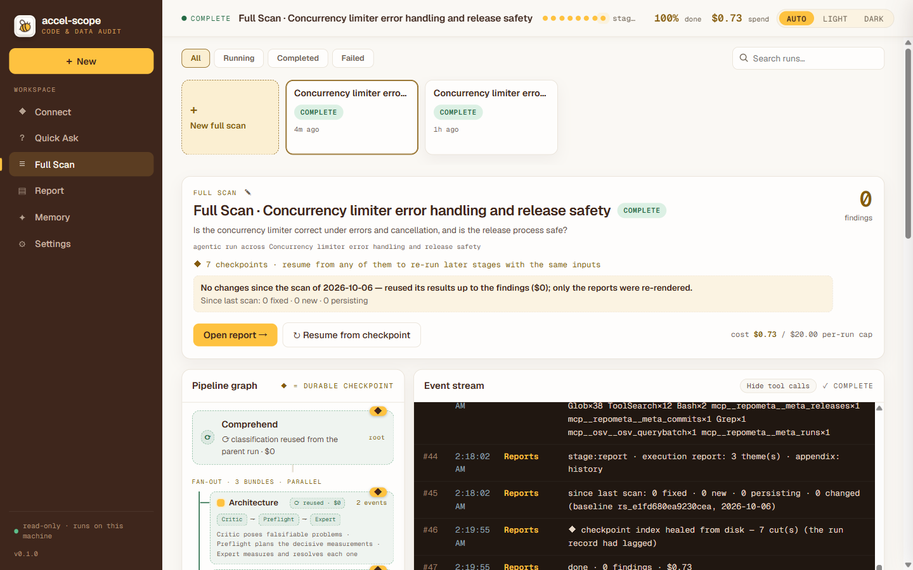

# accel-scope

**Point an AI auditor at your repositories (and, optionally, your warehouse) and get an evidence-backed report plus a fix plan your coding agent can run.**



accel-scope runs on your machine. It clones the code you select read-only, lets a team of Claude agents investigate it, verifies every claim against the code, and writes two reports: a short **Leadership** brief (what matters and what to decide) and an **Execution** report (every finding with evidence, the fix, how to verify it, and a `REMEDIATION.md` you can hand to a coding agent).

## What it does

- **Quick Ask** — ask one question about your code or data ("Where do we compute monthly revenue, and do the two dashboards agree?"). One agent investigates and answers with cited evidence. Typically $0.30–1.
- **Full Scan** — a whole-repo audit. A comprehension agent decides which expert lenses apply (security & supply chain, architecture & code health, release engineering, API stability, business logic, data trust, mobile, multi-tenancy, …); each lens poses falsifiable hypotheses and measures them against the code and connected data. Claims are re-checked by an adversarial audit before they reach the report. Typically $5–30.
- **Incremental re-scan** — scanning the same code again reuses everything the changes did not touch and reports what is new, fixed, or still open since the last scan.
- **Memory** — durable notes about your projects (metric definitions, known traps, conventions) that later runs recall as prior context. Stored locally; editable and revertable.
- **Read-only, always** — agents can read and query; they cannot write to your repos or data sources.

## Quick start

Requirements: Node.js 22.7+ and git.

```bash
git clone https://github.com/ai-theresa-lab/accel-scope-oss.git && cd accel-scope-oss
npm ci
ANTHROPIC_API_KEY=sk-ant-... npm start
```

Open <http://localhost:4317>. (You can also leave the key out and paste it in **Settings → API keys**.)

With Docker:

```bash
docker build -t accel-scope .
docker run --rm -p 127.0.0.1:4317:4317 -v accel-scope-data:/data -e ANTHROPIC_API_KEY=sk-ant-... accel-scope
```

## API keys and cost

All model usage bills **your own** API keys. Keys are only ever sent to the provider's API.

| Key | | Used for |
|---|---|---|
| `ANTHROPIC_API_KEY` | required | Every agent in the pipeline (Claude Agent SDK). A Claude plan token from `claude setup-token` (`sk-ant-oat…`) also works, and without any key an existing local `claude` login is used. |
| `OPENAI_API_KEY` | optional | Report writing, quality-check judges and cross-report reconciliation try OpenAI first (and the `codex` CLI when installed) and fall back to Claude without it. |

Set them in the environment, in a `.env` file in the working directory, or in **Settings → API keys** (memory only, unless you tick *Save keys on this machine*, which writes `<data dir>/keys.json` with mode 0600).

Every run has a spend cap, **$20 by default** — change it in **Settings → Spending** or with `THERESA_RUN_BUDGET`. The run page shows live spend against the cap. The cap stops a run from *starting* new work; a step already in flight finishes, so the final cost can pass the cap by a small amount (the run page says so).

## Your first scan

1. **Connect → Public GitHub URL**: paste `https://github.com/<owner>/<repo>` (no token needed for public repos).
2. **Full Scan → New full scan**: tick the repo, optionally write what you care about in the brief ("is our auth safe?", "why do these two numbers disagree?"), and press **Run diagnosis**.
3. Watch the pipeline live. When it completes, open the **Leadership** report first; the **Execution** report has the details and the `REMEDIATION.md` export.

Private code: connect a GitHub personal access token with read-only access, or a **local folder** on this machine (or upload one from the browser).

## Connectors

All connectors are read-only.

| Source | How |
|---|---|
| Public GitHub repos | Paste URLs. Cloned without credentials. |
| Private GitHub repos | A read-only personal access token. |
| Local folders | A path on this machine, or a folder uploaded from the browser. |
| BigQuery | A service-account key (JSON) with a read-only role. Queries are `SELECT`-only with a per-query scan cap. |
| SQL warehouse / Redis / any MCP server | The URL of a read-only MCP server (and an optional bearer token). |

Connection credentials stay in memory unless you choose to remember them on this machine. Data planes are mounted only into runs you tick them for.

## Privacy and telemetry

Your code, data, questions and reports stay on your machine; they are sent only to the model providers whose keys you configured, as part of the prompts the agents need.

accel-scope sends **anonymous usage telemetry** so we can see how it is used. It is **on by default**, the console tells you so on first run, and you can turn it off at any time:

- `THERESA_TELEMETRY=0` (or `DO_NOT_TRACK=1`) in the environment, or the switch in **Settings → Telemetry**;
- `npm start -- --print-telemetry` prints every payload exactly as it is sent.

What is sent (and nothing else):

| Field | Content |
|---|---|
| `installId` | A random ID generated once (reset when you turn telemetry off). |
| `version`, `os`, `arch`, `node` | App version, OS family, CPU architecture, Node major version. |
| `event` | `start`, `quick-ask`, `full-scan` or `incremental`. |
| `outcome`, `durationSec` | Complete / error / stopped, and the run's duration. |
| `costBucket` | Spend as a range: `0`, `<1`, `1-5`, `5-10`, `10-30`, `30-100`, `100+` (USD). |
| `bundles` | IDs of the built-in expert lenses that ran (e.g. `appsec`). |
| `connectorKinds` | The kinds of sources a run used (e.g. `github`, `warehouse`). |
| `findings` | Counts by severity and by lens. |
| `degradedStages`, `failedStages` | Names of built-in pipeline stages that fell back or failed. |
| `keyProvider` | Which kind of key was configured (`anthropic`, `anthropic+openai`, `claude-subscription`). |
| `ts` | The time, rounded to the hour. |

Never sent: repository names or URLs, code, file paths, questions or briefs, finding text, reports, keys, emails, hostnames or usernames. The collector does not record IP addresses. Its source is in [`telemetry-collector/`](telemetry-collector/).

## Security

The console has **no login**: it is a single-user app. It listens on `127.0.0.1` by default, and the Docker example publishes the port on `127.0.0.1` only. Anyone who can reach the port can run scans on your keys and read your reports, so do not expose it to a network without putting your own authentication in front of it.

Reports are generated by language models from code you scan, so they are served under a strict Content-Security-Policy in a sandboxed frame. See [SECURITY.md](SECURITY.md) to report a vulnerability.

## Configuration

| Variable | Default | |
|---|---|---|
| `PORT` / `HOST` | `4317` / `127.0.0.1` | Where the console listens. |
| `THERESA_DATA_DIR` | `./.data` | Run history, reports, memory, settings. |
| `THERESA_RUN_BUDGET` | `20` | Per-run spend cap in USD (overrides the Settings value). |
| `THERESA_TELEMETRY` | on | `0` turns telemetry off. |
| `THERESA_LOCAL_AUDIT` | on | `0` disables scanning local folders by path. |
| `THERESA_CODEINTEL` | off | `1` enables the code-intelligence plane (needs [repowise](https://github.com/repowise-dev/repowise), AGPL-3.0, on `PATH` or `THERESA_REPOWISE_BIN`). |
| `THERESA_OSV` | off | OSV vulnerability lookups run automatically for public-only scans; `1` also allows them for private code (package names and versions are sent to api.osv.dev). |
| `THERESA_MEMORY` | on | `off` disables memory recall and writes. |

## Limitations

- Requires an Anthropic key (or a Claude login); an OpenAI-only setup is not supported yet.
- One heavy run at a time; further Full Scans queue.
- Findings are produced by language models and verified against the code, but they can still be wrong. Each one carries its evidence and a "how to verify" step — check before you act.
- Scanning very large monorepos is slow and expensive; select the repos or folders that matter.

## Contributing

Issues and pull requests are welcome — see [CONTRIBUTING.md](CONTRIBUTING.md). Run `npm run typecheck`, `npm test` and `npm run check:english` before opening a PR.

## License

accel-scope is licensed under the [Apache License 2.0](LICENSE). It depends on the [Claude Agent SDK](https://www.npmjs.com/package/@anthropic-ai/claude-agent-sdk), which is installed from npm and governed by Anthropic's own terms. See [NOTICE](NOTICE) for third-party components.
